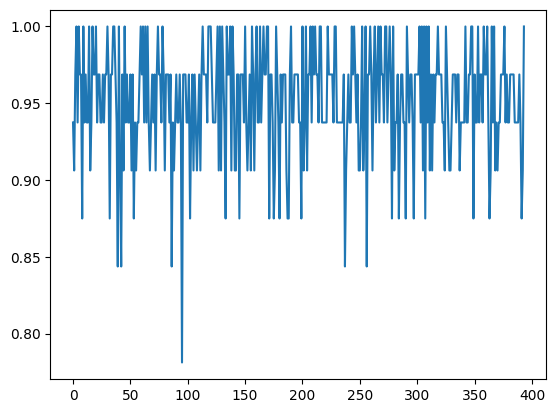
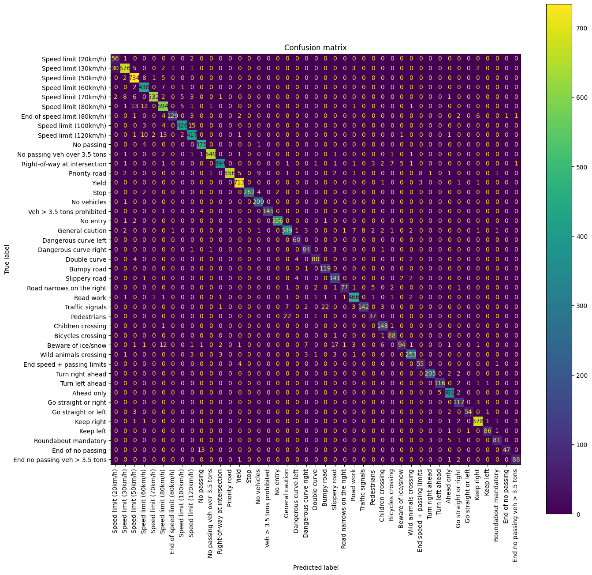
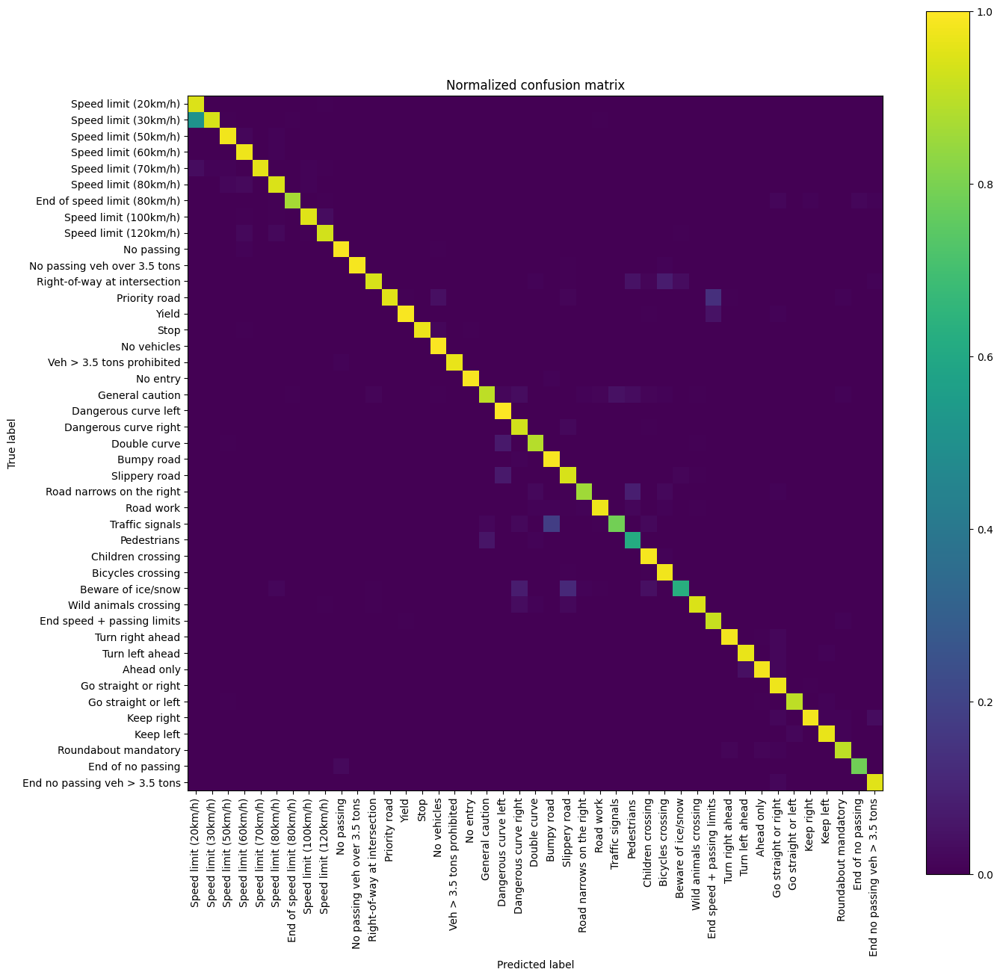

# Model no. 5
- Input size: 128x128
- Batch size: 8
- Approx. speed: 25ms
- Trained with an EarlyStopping callback monitoring *val_loss* with patience *10* (15 epochs)

 

    Model: "sequential_3"
    _________________________________________________________________
    Layer (type)                Output Shape              Param #   
    =================================================================
    conv2d_12 (Conv2D)          (None, 126, 126, 16)      448       
                                                                    
    max_pooling2d_9 (MaxPooling  (None, 63, 63, 16)       0         
    2D)                                                             
                                                                    
    conv2d_13 (Conv2D)          (None, 61, 61, 32)        4640      
                                                                    
    max_pooling2d_10 (MaxPoolin  (None, 30, 30, 32)       0         
    g2D)                                                            
                                                                    
    conv2d_14 (Conv2D)          (None, 28, 28, 16)        4624      
                                                                    
    conv2d_15 (Conv2D)          (None, 26, 26, 16)        2320      
                                                                    
    max_pooling2d_11 (MaxPoolin  (None, 13, 13, 16)       0         
    g2D)                                                            
                                                                    
    flatten_3 (Flatten)         (None, 2704)              0         
                                                                    
    dense_6 (Dense)             (None, 256)               692480    
                                                                    
    ...
    Total params: 715,563
    Trainable params: 715,563
    Non-trainable params: 0
    
## Results
**Precision: 1.0, Recall: 1.0, Accuracy: 0.9522, F1 Score: 0.9273**

    Lowest accuracy: 0.78125 (batch 95), highest accuracy: 1.0 (batch 3)

    Most confused classes:
    Speed limit (80km/h) - Speed limit (30km/h)
    Bicycles crossing - Right-of-way at intersection
    Dangerous curve right - General caution
    Ahead only - Turn right ahead
    Speed limit (80km/h) - Speed limit (100km/h)
    Dangerous curve right - Traffic signals
    Speed limit (60km/h) - Speed limit (120km/h)

 

### Confusion matrices

